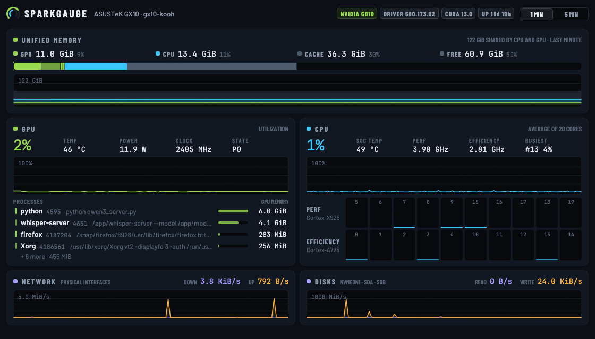

<p align="center">
  
</p>

<h1 align="center">SparkGauge</h1>

<p align="center">
  A desktop system monitor for NVIDIA GB10 machines — DGX Spark, ASUS Ascent GX10 and the rest of the family —<br>
  that shows the GPU next to the CPU and tells you how the unified memory is really split.
</p>



## Why

The GB10 has no dedicated VRAM: CPU and GPU share the same 128 GB of LPDDR5X.
That breaks the usual tools:

- The GNOME System Monitor shows no GPU at all.
- `nvidia-smi` prints `Memory-Usage: Not Supported`, because there is no
  device memory to report.
- The answer you actually want — *of my 128 GB, how much is the GPU holding,
  how much the CPU, how much is free?* — is nowhere on screen.

There are good terminal monitors for the Spark already (see
[Related projects](#related-projects)). SparkGauge is the **desktop window**:
the one you leave open next to your work, like the System Monitor, with the
GPU in it.

## What it shows

- **Unified memory** split into four parts that add up to the total — GPU,
  CPU, reclaimable cache, free — as a bar broken down per GPU process, plus a
  stacked history.
- **GPU**: utilization, temperature, power, clock, performance state, and
  the processes holding GPU memory with their command lines.
- **CPU**: overall usage, one bar per core grouped by cluster (10 × Cortex-X925
  performance cores, 10 × Cortex-A725 efficiency cores on the GB10), cluster
  frequencies, SoC temperature, busiest core.
- **Network and disks**: throughput over physical devices only, so Docker
  bridges, veth pairs and loop devices do not count twice.
- One-minute or five-minute history, with a read-out under the pointer on
  every chart.

It samples twice a second and only repaints when a new sample arrives.

### How the memory is split

| Part  | Computed as                                                      |
|-------|------------------------------------------------------------------|
| GPU   | Sum of the memory NVML reports for each GPU process               |
| CPU   | `MemTotal − MemAvailable − GPU`: programs, kernel, CPU side of GPU processes |
| Cache | `MemAvailable − MemFree`: page cache the kernel gives back on demand |
| Free  | `MemFree`                                                         |

The GPU figure is read per process because NVML has no device-wide memory
total on the GB10. It is capped at the memory in use, so the four parts
always add up to `MemTotal`.

## Install

### Prebuilt binary

Download the `linux-aarch64` archive from the
[latest release](https://github.com/kooh16/sparkgauge/releases/latest), then:

```sh
tar xzf sparkgauge-*-linux-aarch64.tar.gz
cd sparkgauge-*-linux-aarch64
./install.sh
```

### From source

You need a Rust toolchain (1.88 or newer, from [rustup.rs](https://rustup.rs))
and the NVIDIA driver, which DGX OS already ships.

```sh
git clone https://github.com/kooh16/sparkgauge.git
cd sparkgauge
./install.sh
```

`install.sh` installs SparkGauge for your user only — from the source tree it
builds the binary first:
the binary goes to `~/.local/bin`, and an icon and launcher entry go under
`~/.local/share`. SparkGauge then appears among your applications.

To just run it from the source tree:

```sh
cargo run --release
```

### Requirements

- Linux on a GB10 machine. SparkGauge was developed on an ASUS Ascent GX10
  running DGX OS. It should run on any Linux box with an NVIDIA driver, but
  the cluster view and the memory split are designed for the GB10.
- NVML (`libnvidia-ml.so`, part of the driver) is loaded at run time. Without
  it the window still shows CPU, memory, network and disks.

## Command line

```
sparkgauge [--screenshot FILE [--after SECONDS]] [--size WxH]
```

`--screenshot` saves a PNG of the window after `--after` seconds (default 3)
and quits; the README screenshot is made that way.

## Related projects

Terminal and web tools for the same machines, all worth a look:

- [DennySORA/dgxtop](https://github.com/DennySORA/dgxtop) — full-featured TUI in Rust, NVML-based.
- [parallelArchitect/sparkview](https://github.com/parallelArchitect/sparkview) — TUI with GB10-aware memory, PSI and power rails.
- [wentbackward/nv-monitor](https://github.com/wentbackward/nv-monitor) — TUI and Prometheus exporter in one C binary.
- [chappa-ai-llc/spark-smi](https://github.com/chappa-ai-llc/spark-smi) — TUI with a cluster fleet view.
- [bidual/awesome-dgx-spark](https://github.com/bidual/awesome-dgx-spark) — the community list.

## License

MIT — see [LICENSE](LICENSE).

The bundled fonts are under the SIL Open Font License: Barlow
([assets/fonts/OFL-Barlow.txt](assets/fonts/OFL-Barlow.txt)) and JetBrains Mono
([assets/fonts/OFL-JetBrainsMono.txt](assets/fonts/OFL-JetBrainsMono.txt)).

SparkGauge is an independent project, not affiliated with or endorsed by
NVIDIA. NVIDIA, DGX, DGX Spark and GB10 are trademarks of NVIDIA Corporation.
